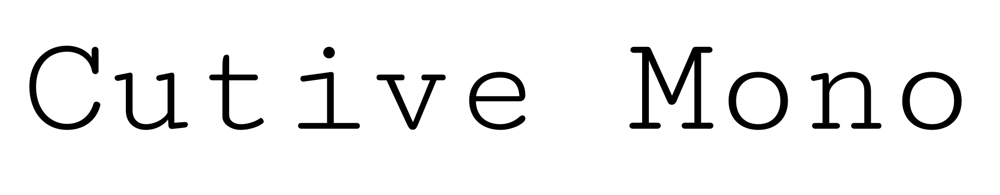
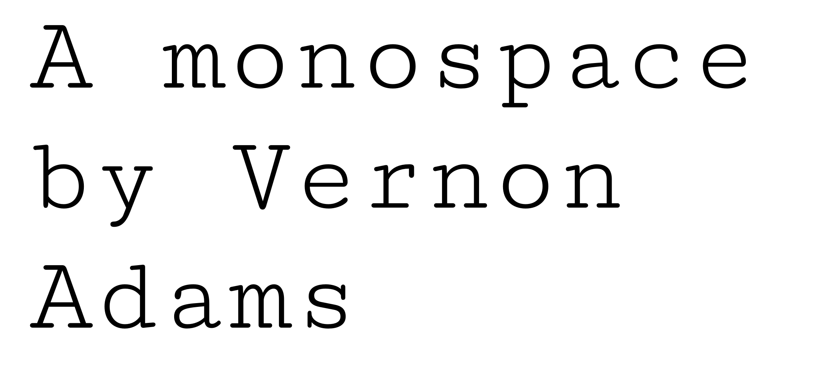

Cutive Mono
===============
by Vernon Adams

## About

The design of Cutive, and this monospace sister family Cutive Mono, is based on a number of classic typewriter typefaces, in particular the faces of IBM's 'Executive,' and the older 'Smith-Premier.' 

In Cutive these old faces re-emerge as webfonts that are useful for adding character to body texts as well as in larger sizes for headers and display.

## License

This Font Software is licensed under the SIL Open Font License, Version 1.1.
This license is copied below, and is also available with a FAQ at
https://openfontlicense.org
